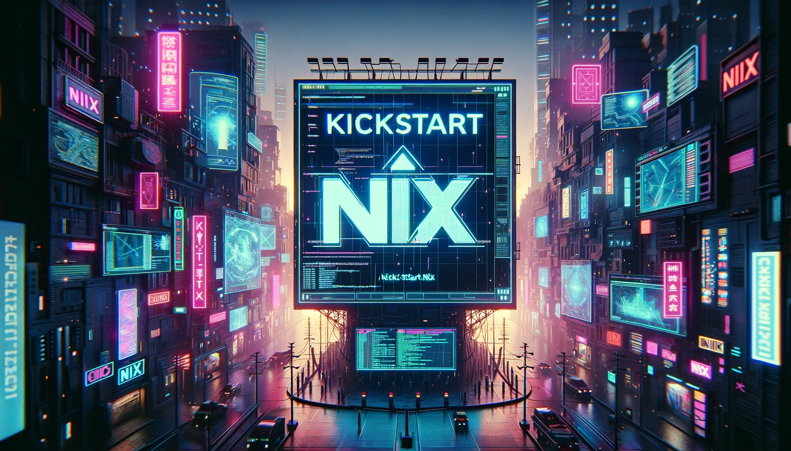

# kickstart.nix

Kickstart your Nix environments.

[](https://github.com/ALT-F4-LLC/kickstart.nix/actions/workflows/flake.yml)
[](https://github.com/ALT-F4-LLC/kickstart.nix/actions/workflows/flake-home-manager.yml)
[](https://github.com/ALT-F4-LLC/kickstart.nix/actions/workflows/flake-language.yml)
[](https://github.com/ALT-F4-LLC/kickstart.nix/actions/workflows/flake-system.yml)



## Guides
- [Setup Linux](#setup-linux)
- [Setup macOS](#setup-macos)
- [Setup NixOS](#setup-nixos)
## Templates
- Languages
    - [Bash](#bash)
    - [C++ (cmake)](#cpp-cmake)
    - [Dart](#dart)
    - [Go (module)](#go-module)
    - [Haskell](#haskell)
    - [Lua (application)](#lua-application)
    - [NestJS](#nestjs)
    - [Node.js (backend)](#nodejs-backend)
    - [OCaml](#ocaml)
    - [PHP](#php)
    - [Powershell](#powershell)
    - [Python (application)](#python-application)
    - [Python (package)](#python-package)
    - [Rust](#rust)
    - [Swift](#swift)
    - [Vite (React)](#vite-react)
    - [Zig](#zig)
    - [Nim](#nim)
- Systems
    - Linux
        - [Home Manager](#home-manager)
    - macOS
        - [Desktop](#macos)
    - NixOS
        - [Desktop](#nixos-desktop)
        - [Headless](#nixos-headless)

### Guides

#### Setup Linux

Guide for setting up Nix on non-NixOS based Linux systems.

1. Install `nixpkgs` with official script:

> [!NOTE]
> The offical docs suggest using `daemon` mode to install with this approach. Nix currently does not support SELINUX enabled.

```bash
sh <(curl -L https://nixos.org/nix/install) --daemon
```

2. Edit `/etc/nix/nix.conf` to enable the following settings:

```bash
experimental-features = nix-command flakes
```

3. Create a new directory for your `flake.nix` configuration:

```bash
mkdir -p ~/kickstart.nix
cd ~/kickstart.nix
```

4. Using `nix flake init` generate the `kickstart.nix` template locally:

```bash
nix flake init -t github:ALT-F4-LLC/kickstart.nix#home-manager
```

5. Update following value(s) in `flake.nix` configuration:

> [!IMPORTANT]
> Both `homeDirectory` and `username` must be updated with your user home directory and username. Once updated, remove `throw` before each value to remove errors while switching.

```nix
homeManagerModule = import ./module/home-manager.nix {
  homeDirectory = throw "<enter homeDirectory in flake.nix>"; # TODO: home directory of the user
  username = throw "<enter username in flake.nix>"; # TODO: username of the user
};
```

6. Run `home-manager` from `nixpkgs` to build and switch environments:

> [!IMPORTANT]
> This template supports the following systems: `aarch64-darwin`, `aarch64-linux`, `x86_64-darwin` and `x86_64-linux`.

```bash
# for ARM systems running macOS
nix run nixpkgs#home-manager -- build --flake .#aarch64-darwin
nix run nixpkgs#home-manager -- switch --flake .#aarch64-darwin

# for ARM systems running Linux
nix run nixpkgs#home-manager -- build --flake .#aarch64-linux
nix run nixpkgs#home-manager -- switch --flake .#aarch64-linux

# for Intel systems running macOS
nix run nixpkgs#home-manager -- build --flake .#x86_64-darwin
nix run nixpkgs#home-manager -- switch --flake .#x86_64-darwin

# for Intel systems running Linux
nix run nixpkgs#home-manager -- build --flake .#x86_64-linux
nix run nixpkgs#home-manager -- switch --flake .#x86_64-linux
```

Congrats! You've setup Home Manager on your existing operating system!

Be sure to explore the files below to get started customizing:

- `module/home-manager.nix` for `Home Manager` related settings
- `flake.nix` for flake related settings

#### Setup macOS

Guide for setting up Nix on macOS based systems.

1. Install `nixpkgs` with official script:

```bash
sh <(curl -L https://nixos.org/nix/install)
```

2. Install `nix-darwin` with official steps:

```bash
nix-build https://github.com/LnL7/nix-darwin/archive/master.tar.gz -A installer
./result/bin/darwin-installer
```

3. Answer the following with `y` to edit your default `configuration.nix` file:

```bash
Would you like to edit the default configuration.nix before starting? [y/n] y
```

4. Add the following to `configuration.nix` to enable `nix-command` and `flakes` features:

```nix
nix.settings.experimental-features = [ "nix-command" "flakes" ];
```

5. Answer the following with `y` to setup `<darwin>` in `nix-channel` (though it won't be used):

```bash
Would you like to manage <darwin> with nix-channel? [y/n] y
```

6. Create a new directory for your `flake.nix` configuration:

```bash
mkdir -p ~/kickstart.nix
cd ~/kickstart.nix
```

7. Using `nix flake init` generate the `kickstart.nix` template locally:

```bash
nix flake init -t github:ALT-F4-LLC/kickstart.nix#darwin
```

8. Update the following value(s) in `flake.nix` configuration:

> [!IMPORTANT]
> The `username` value must be updated with your system username. Once updated, remove `throw` to remove error while switching.

```nix
let
    username = throw "<username>"; # TODO: replace with user name and remove throw 
in
```

9. Switch to `kickstart.nix` environment for your system with flake configuration:

```bash
darwin-rebuild switch --flake ".#aarch64" # M Series Chipsets
darwin-rebuild switch --flake ".#x86_64" # Intel Chipsets
```

Congrats! You've setup Nix with Home Manager on macOS!

Be sure to explore the files below to get started customizing:

- `system/darwin.nix` for all `nix-darwin` related settings
- `module/configuration.nix` for `Nix` related settings
- `module/home-manager.nix` for `Home Manager` related settings
- `flake.nix` for flake related settings

#### Setup NixOS

Guide for setting up NixOS based systems.

1. Install NixOS using the [latest ISO image](https://nixos.org/download#nixos-iso) for your system.

2. Add the following to `/etc/nixos/configuration.nix` to enable `nix-command` and `flakes` features:

```nix
nix.extraOptions = "experimental-features = nix-command flakes";
```

3. Update you system to reflect the changes:

```bash
sudo nixos-rebuild test
sudo nixos-rebuild switch
```

4. Create a new directory for your `flake.nix` configuration:

```bash
mkdir -p ~/kickstart.nix
cd ~/kickstart.nix
```

7. Using `nix flake init` generate the `kickstart.nix` template of your choice locally:

```bash
nix flake init -t github:ALT-F4-LLC/kickstart.nix#nixos-desktop
nix flake init -t github:ALT-F4-LLC/kickstart.nix#nixos-minimal
```

6. Update the following value(s) in `flake.nix` configuration:

- For `desktop` flake template:

> [!IMPORTANT]
> Both `username` and `password` must be updated with your user username. Once updated, remove `throw` before each value to remove errors while switching. If you'd rather use a [hashed password](https://nixpkgs-manual-sphinx-markedown-example.netlify.app/generated/options-db.xml.html?highlight=hashedpassword#users-users-name-hashedpassword) replace `password` with `hashedPassword` with your password hash.

```nix
let
    nixos-system = import ./system/nixos.nix {
        inherit inputs;
        username = throw "<username>"; # REQUIRED: replace with user name and remove throw
        password = throw "<password>"; # REQUIRED: replace with password and remove throw
        desktop = "gnome"; # optional: "gnome" by default, or "plasma5" for KDE Plasma
    };
in
```

- For `minimal` flake template:

```nix
let
    nixos-system = import ./system/nixos.nix {
        inherit inputs;
        username = throw "<username>"; # REQUIRED: replace with user name and remove throw
        password = throw "<password>"; # REQUIRED: replace with password and remove throw
    };
in
```

7. Switch to `kickstart.nix` environment for your system with flake configuration:

> [!IMPORTANT]
> We use `--impure` due to how `/etc/nixos/hardware-configuration.nix` is generated and stored on the system after installation. To avoid using this flag, copy `hardware-configuration.nix` file locally and replace import in the template [see example](https://github.com/ALT-F4-LLC/dotfiles-nixos/blob/main/lib/default.nix#L54).

- For `aarch64` platforms:

```bash
sudo nixos-rebuild test --flake ".#aarch64" --impure # M Series Chipsets
sudo nixos-rebuild switch --flake ".#aarch64" --impure # M Series Chipsets
```

- For `x86_64` platforms:

```bash
sudo nixos-rebuild test --flake ".#x86_64"  --impure # Intel Chipsets
sudo nixos-rebuild switch --flake ".#x86_64" --impure # Intel Chipsets
```

Congrats! You've setup NixOS with Home Manager!

Be sure to explore the files below to get started customizing:

- `module/configuration.nix` for more `NixOS` system related settings
- `module/home-manager.nix` for `Home Manager` related settings
- `system/nixos.nix` for `NixOS` system related settings
- `flake.nix` for flake related settings

### Languages

#### Bash

Used for Bash scripts.

```bash
nix flake init -t github:ALT-F4-LLC/kickstart.nix#bash
```

#### <a name="cpp-cmake"></a> C++ (cmake)

Used for C++ projects using CMake as a build system.

```bash
nix flake init -t github:ALT-F4-LLC/kickstart.nix#cpp-cmake
```

#### Dart

Used for Dart applications.

```bash
nix flake init -t github:ALT-F4-LLC/kickstart.nix#dart
```

#### Go (module)

Used for modern Go apps setup with `go.mod` system.

> [!IMPORTANT]
> Be sure to update `go.mod` with proper repository after running `init` command.

```bash
nix flake init -t github:ALT-F4-LLC/kickstart.nix#go-mod
```

#### Haskell

Used for Haskell applications.

```bash
nix flake init -t github:ALT-F4-LLC/kickstart.nix#haskell
```

#### Lua (application)

Used for Lua script applications. This template creates a shell script wrapper which executes your Lua code. See `flake.nix` for more.

> [!NOTE]
> We wrap Lua because we are using an interpreted language which requires both binary and code to run. This is similar to `console scripts` in the `python-app` template.

```bash
nix flake init -t github:ALT-F4-LLC/kickstart.nix#lua-app
```

#### NestJS

Used for NestJS applications. The template builds using `npm`.

```bash
nix flake init -t github:ALT-F4-LLC/kickstart.nix#nestjs
```

To update your dependencies, install/upgrade them as normal via NPM, then use
the [`prefetch-npm-deps` package from nixpkgs](https://github.com/NixOS/nixpkgs/blob/master/doc/languages-frameworks/javascript.section.md#prefetch-npm-deps-javascript-buildnpmpackage-prefetch-npm-deps)
to generate a new `npmDepsHash` value for `packages.default` in the Flake.

```bash
$ nix shell 'nixpkgs#prefetch-npm-deps' -c prefetch-npm-deps package-lock.json
...
sha256-nTTzkQEdnwWEQ/3uy8hUbPsRvzM53xuoJHoQhR3E/zk=
```

#### Node.js (backend)

Used for Node.js backend applications. The template builds using `npm`, and does
not assume you use TypeScript.

```bash
nix flake init -t github:ALT-F4-LLC/kickstart.nix#nodejs-backend
```

To update your dependencies, install/upgrade them as normal via NPM, then use
the [`prefetch-npm-deps` package from nixpkgs](https://github.com/NixOS/nixpkgs/blob/master/doc/languages-frameworks/javascript.section.md#prefetch-npm-deps-javascript-buildnpmpackage-prefetch-npm-deps)
to generate a new `npmDepsHash` value for `packages.default` in the Flake.

```bash
$ nix shell 'nixpkgs#prefetch-npm-deps' -c prefetch-npm-deps package-lock.json
...
sha256-nTTzkQEdnwWEQ/3uy8hUbPsRvzM53xuoJHoQhR3E/zk=
```

> [!TIP]
> To add TypeScript, install it with `npm install --save-dev typescript`, add a
> `build` script to `package.json` that calls `tsc`, and then remove
> `dontNpmBuild = true;` from `packages.default` in your Flake.

#### OCaml

Used for OCaml applications.

```bash
nix flake init -t github:ALT-F4-LLC/kickstart.nix#ocaml
```

#### PHP

Used for PHP applications

```bash
nix flake init -t github:ALT-F4-LLC/kickstart.nix#php
```

#### Powershell

Used for Powershell applications.

```bash
nix flake init -t github:ALT-F4-LLC/kickstart.nix#powershell
```

#### Python (application)

Used for runnable Python apps setup with `setup.py` and includes wrapped console scripts that can be executed from CLI. To build re-useable Python packages, use `python-pkg` template. 

```bash
nix flake init -t github:ALT-F4-LLC/kickstart.nix#python-app
```

#### Python (package)

Used for Python packages setup with `setup.py` that can be re-used within other Nix-built applications or packages. To build runnable Python apps, use `python-app` template. 

```bash
nix flake init -t github:ALT-F4-LLC/kickstart.nix#python-pkg
```

#### Rust

Used for Rust applications.

```bash
nix flake init -t github:ALT-F4-LLC/kickstart.nix#rust
```

#### Swift

Used for Swift applications packages with SwiftPM.

```bash
nix flake init -t github:ALT-F4-LLC/kickstart.nix#swiftpm
```

To update your dependencies, while in the direnv dev shell, run:

```bash
# Update current dependency lockfile (Package.resolved)
swift package resolve

# Update Nix bindings for dependency set
swiftpm2nix
```

Then build again.

#### Vite (React)

Used for React-based frontends built with Vite. The template builds using `npm`.

```bash
nix flake init -t github:ALT-F4-LLC/kickstart.nix#vite-react
```

To update your dependencies, install/upgrade them as normal via NPM, then use
the [`prefetch-npm-deps` package from nixpkgs](https://github.com/NixOS/nixpkgs/blob/master/doc/languages-frameworks/javascript.section.md#prefetch-npm-deps-javascript-buildnpmpackage-prefetch-npm-deps)
to generate a new `npmDepsHash` value for `packages.default` in the Flake. This
is included in the development shell provided by the flake.

```bash
$ prefetch-npm-deps package-lock.json
...
sha256-nTTzkQEdnwWEQ/3uy8hUbPsRvzM53xuoJHoQhR3E/zk=
```

#### Zig

Used for Zig applications.

```bash
nix flake init -t github:ALT-F4-LLC/kickstart.nix#zig
```

#### Nim

Used for Nim applications.

```bash
nix flake init -t github:ALT-F4-LLC/kickstart.nix#nim
```

### Systems

#### Home Manager

Home Manager template allows you to run Nix with Home Manager on non-NixOS based Linux systems.

> [!TIP]
> This setup is ideal for developers interested in running Linux distros other than NixOS.

```bash
nix flake init -t github:ALT-F4-LLC/kickstart.nix#nixos-minimal
```
#### macOS

macOS template allows you to run Nix tools on native Apple hardware.

> [!TIP]
> This setup is ideal for developers already using macOS.

```bash
nix flake init -t github:ALT-F4-LLC/kickstart.nix#darwin
```

#### NixOS (desktop)

NixOS desktop template includes base operating system with GNOME (default) windows manager included. You can also use `plasma5` by changing `desktop` value in `flake.nix` file.

> [!TIP]
> This setup is ideal for getting started moving to NixOS as your main desktop.

```bash
nix flake init -t github:ALT-F4-LLC/kickstart.nix#nixos-desktop
```

#### NixOS (headless)

NixOS headless (minimal) template includes base operating system without any windows manager.

> [!TIP]
> This setup is ideal for servers and other headless tasks.

```bash
nix flake init -t github:ALT-F4-LLC/kickstart.nix#nixos-minimal
```
